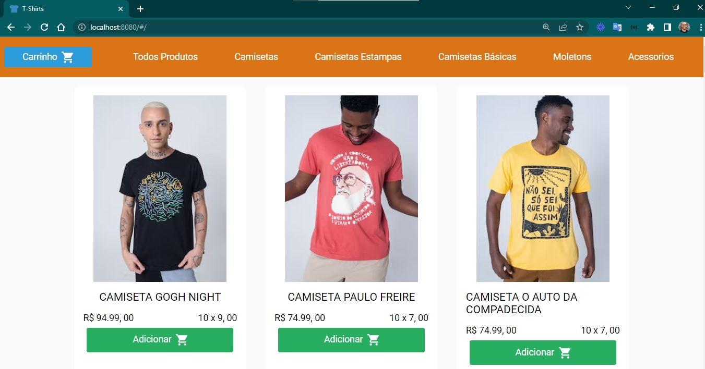
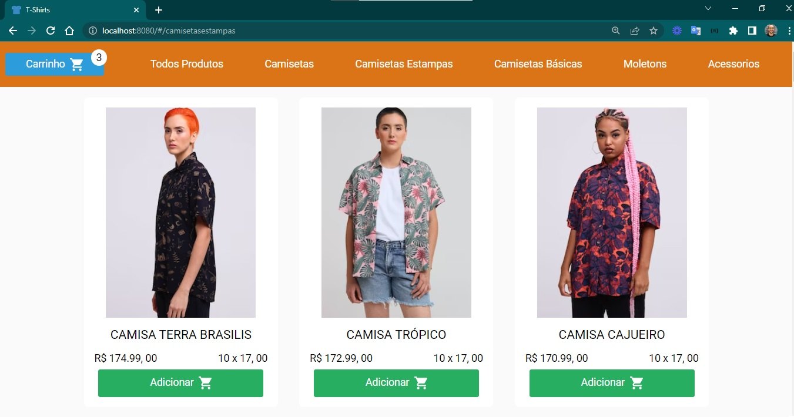
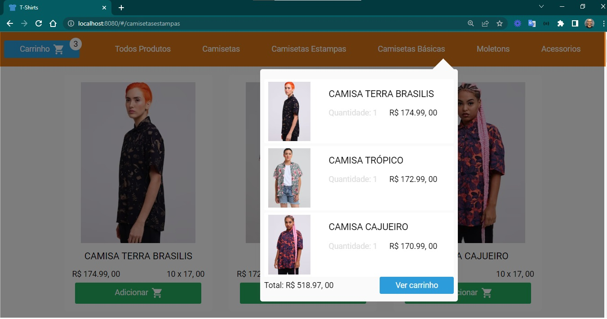
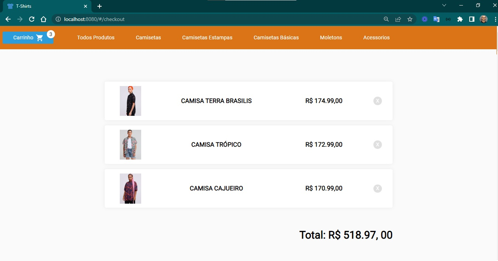
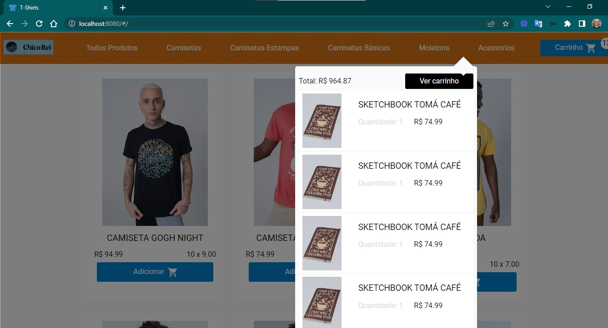

### T-Shirt

As especificações do projeto:

- [x] camisetas
- [x] moletons
- [x] adicionar mais produtos: camisetas estampas, camisetas básicas, acessórios
- [x] informações dos produtos
- [x] cores de identificação
- [x] favicon

### Telas do projeto

  
  
  
  
  

### Funcionalidades do projeto

- [x] utilizar uma API ou Json para os dados: criado objetos em `store.js`
- [x] catálogo de produtos
- [ ] catálogo de produtos com filtro
- [ ] catálogo de produtos com paginação
- [x] página de produto
- [ ] página de produto com seleção de tamanho
- [ ] página de produto com ação de compra
- [x] página do carrinho
- [ ] página de carrinho com alteração de quantidade
- [ ] página de carrinho com adição de cupom

### Tecnologias do projeto

- [ ] Larabel
- [x] Vue.js na interface
- [x] consumir API
- [x] Github para o versionamento do repositório
- [x] instruções no README do projeto

### Revisão do Projeto

- [x] Página de detalhes de produto: estilizar com cores
- [x] Modal de informações: estilizar com cores e ajustar tamanho a quantidade do texto
- [x] Menu: aperfeiçoar design e logo da loja
- [x] Price: corrigir o formato de exibição

### Gestão do projeto

- branch `main` para produção
- branch `developer-testing` receber as resoluções, tratar e testar as tarefas e mergear com a produção main.
- branch `feat/identidade-visual`
- branch `feat/api-json`
- branch `feat/details-product`
- branch `feat/modal-design`
- branch `feat/menu-design`
- branch `feat/price`

### Próximo passo

- [ ] botão para voltar ao topo
- [ ] menu fixado ao topo
- [ ] menu: sinalizar o item selecionado
- [ ] persistir o conteúdo

### Build do projeto

- Na raiz do projeto /t-shirt, instalar as dependências com `npm install`.
- Executar o projeto com `npm run start`.

### Referências

- [guide](http://vuejs-templates.github.io/webpack/)
- [docs for vue-loader](http://vuejs.github.io/vue-loader)
- [madewithvuejs](https://madewithvuejs.com/vue-cart)
- [github-madewithvuejs](https://github.com/crisgon/vue-cart)
