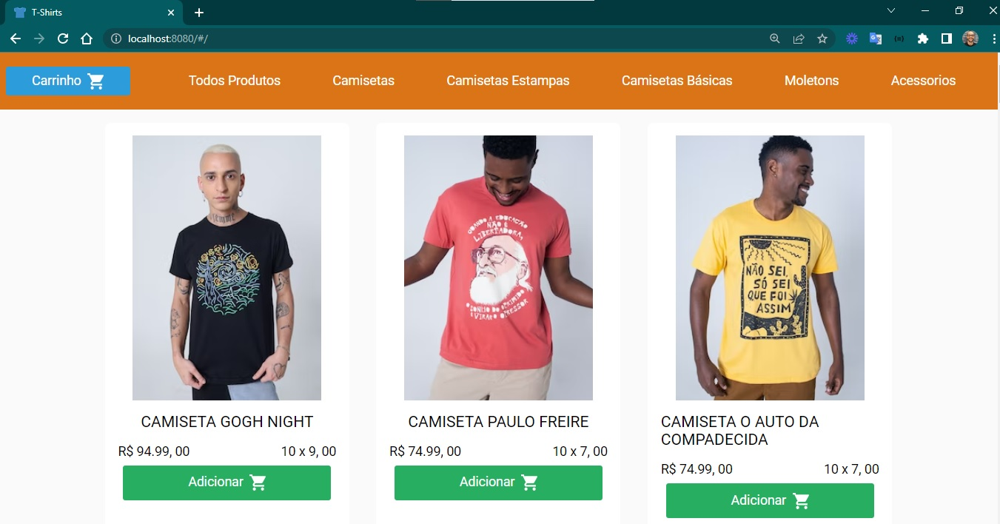
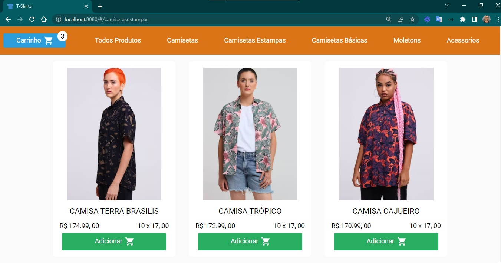
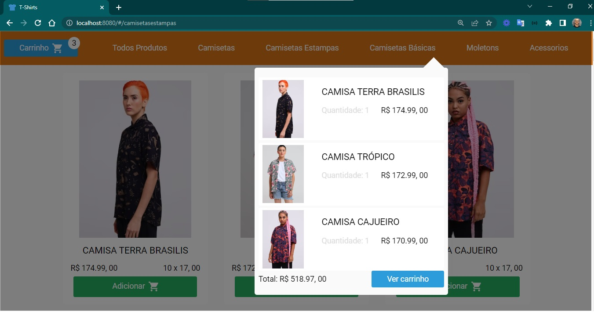
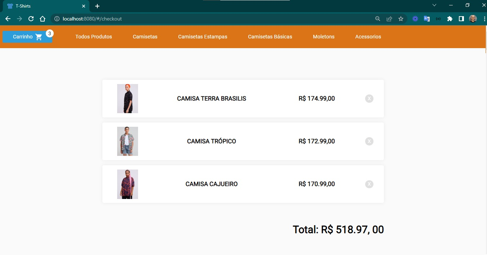
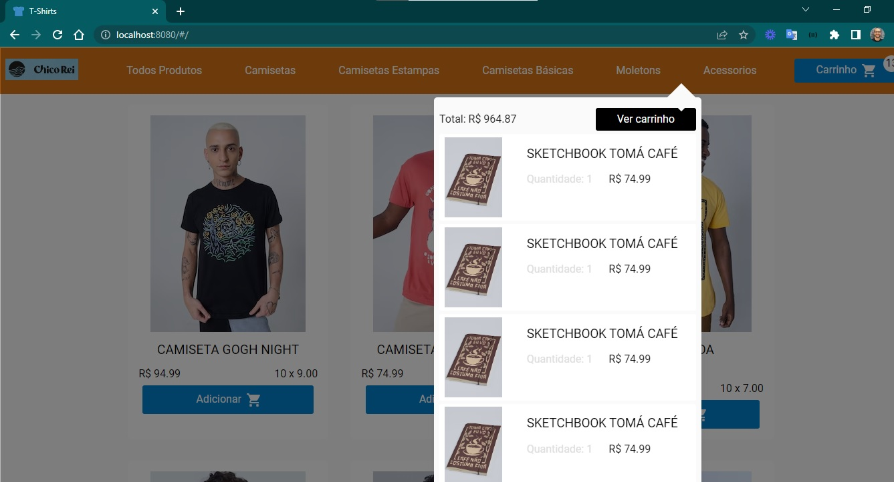

### T-Shirt

As especificações do projeto:

- [x] camisetas
- [x] moletons
- [x] adicionar mais produtos: camisetas estampas, camisetas básicas, acessórios
- [x] informações dos produtos
- [x] cores de identificação
- [x] favicon

### Telas do projeto

  
  
  
  
  

### Funcionalidades do projeto

- [x] utilizar uma API ou Json para os dados: criado objetos em `store.js`
- [x] catálogo de produtos
- [ ] catálogo de produtos com filtro
- [ ] catálogo de produtos com paginação
- [x] página de produto
- [ ] página de produto com seleção de tamanho
- [ ] página de produto com ação de compra
- [x] página do carrinho
- [ ] página de carrinho com alteração de quantidade
- [ ] página de carrinho com adição de cupom

### Tecnologias do projeto

- [ ] Larabel
- [x] Vue.js na interface
- [x] consumir API
- [x] Github para o versionamento do repositório
- [x] instruções no README do projeto

### Revisão do Projeto

- [x] Página de detalhes de produto: estilizar com cores
- [x] Modal de informações: estilizar com cores e ajustar tamanho a quantidade do texto
- [x] Menu: aperfeiçoar design e logo da loja
- [x] Price: corrigir o formato de exibição

### Gestão do projeto

- branch `main` para produção
- branch `developer-testing` receber as resoluções, tratar e testar as tarefas e mergear com a produção main.
- branch `feat/identidade-visual`
- branch `feat/api-json`
- branch `feat/details-product`
- branch `feat/modal-design`
- branch `feat/menu-design`
- branch `feat/price`

### Próximo passo

- [ ] botão para voltar ao topo
- [ ] menu fixado ao topo
- [ ] menu: sinalizar o item selecionado
- [ ] persistir o conteúdo

### Build do projeto

- Na raiz do projeto /t-shirt, instalar as dependências com `npm install`.
- Executar o projeto com `npm run start`.

### Referências

- [guide](http://vuejs-templates.github.io/webpack/)
- [docs for vue-loader](http://vuejs.github.io/vue-loader)
- [madewithvuejs](https://madewithvuejs.com/vue-cart)
- [github-madewithvuejs](https://github.com/crisgon/vue-cart)

## TO DO List do Projeto

### 📱 UI/UX & Navegação

- [ ] **1. Menu Fixo (Sticky Header)**
  - **Objetivo:** Travar a barra de navegação no topo da tela.
  - **Justificativa:** Reduz o atrito na navegação, facilitando acesso rápido ao carrinho ou outras categorias.

- [ ] **2. Sinalização de Rota Ativa**
  - **Objetivo:** Destacar visualmente qual categoria o usuário está visualizando.
  - **Justificativa:** Melhora a localização e usabilidade dentro da loja.

- [ ] **3. Botão "Voltar ao Topo"**
  - **Objetivo:** Botão flutuante que leva o usuário direto para o início da página.
  - **Justificativa:** Facilita o retorno ao menu e filtros em catálogos muito longos, especialmente no mobile.

### 🛒 Conversão & Carrinho

- [ ] **4. Seleção de Tamanhos no Produto**
  - **Objetivo:** Exigir e permitir a escolha do tamanho (P, M, G, GG) antes de adicionar ao carrinho.
  - **Justificativa:** Regra de negócio inegociável para vendas de vestuário.

- [ ] **5. Persistência de Carrinho (Local Storage)**
  - **Objetivo:** Salvar os produtos do carrinho na memória do navegador.
  - **Justificativa:** Evita o abandono do pedido caso o usuário recarregue a página (F5).

- [ ] **6. Gestão de Quantidade no Checkout**
  - **Objetivo:** Inserir botões de `+` e `-` para alterar quantidades na tela do carrinho.
  - **Justificativa:** Dá autonomia para o cliente ajustar o pedido rapidamente na etapa final.

- [ ] **7. Sistema de Cupons de Desconto**
  - **Objetivo:** Adicionar um campo para aplicar códigos promocionais no checkout.
  - **Justificativa:** Fundamental para campanhas de marketing e aumento de conversão.

### 📦 Catálogo & Arquitetura

- [ ] **8. Filtros Dinâmicos**
  - **Objetivo:** Inserir opções para filtrar a listagem de produtos por tipo, preço ou cor.
  - **Justificativa:** Encurta a jornada de busca do cliente, acelerando a decisão de compra.

- [ ] **9. Integração com API Backend (Laravel)**
  - **Objetivo:** Substituir os dados estáticos (`store.js`) por consumo de dados reais de um banco.
  - **Justificativa:** Prepara o sistema para ser escalável e administrável por um painel de gestão.
